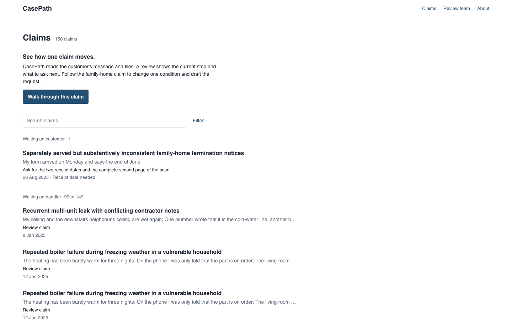
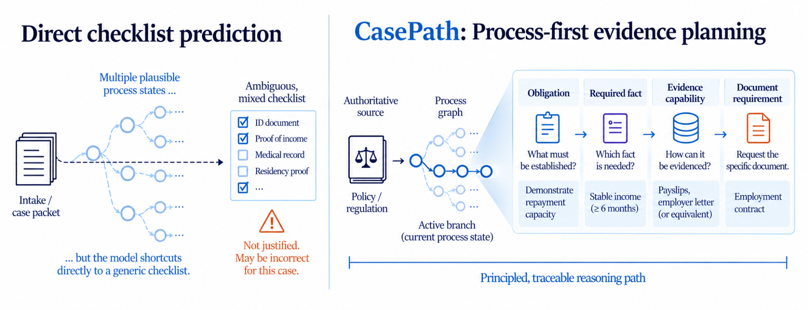
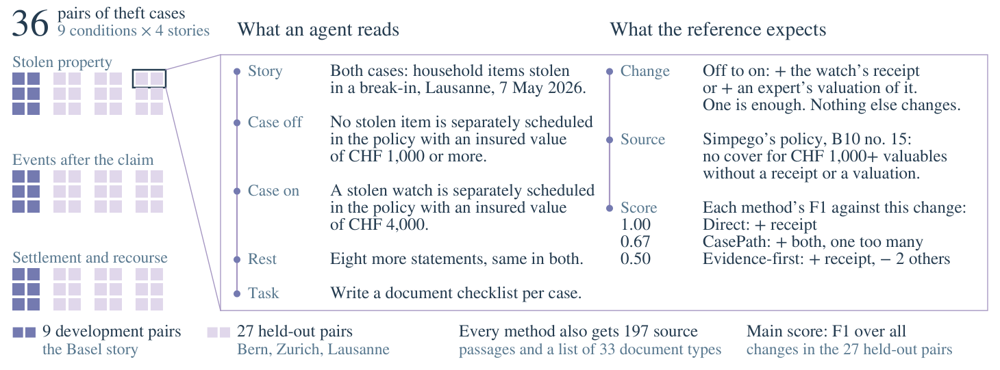
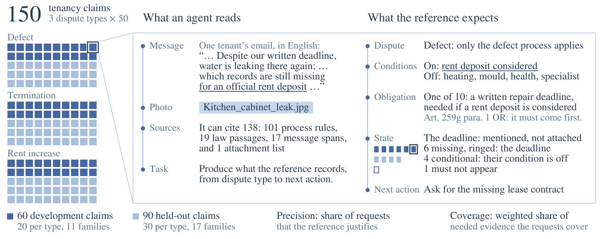

# CasePath

CasePath reads the customer's message and files, shows where the claim stands, and helps the handler ask for what is missing.


*The two notices give different end dates; the receipt dates remain a question. This walkthrough uses a synthetic claim.*

## See one claim

The **Claims** list groups work by who CasePath is waiting for. Each row says what it noticed and what to do next. Select **Walk through this claim** above the list, or open `#claim=clm_f69b1747447bc221`.

Select **Review claim**. Findings appear in **What I noticed** as the review runs. The two end dates link to their exact PDF spans, and **Sources** stays beside the claim on desktop. **Where it stands** shows the done step, the current step, and the next step. Expand **+8 later** for the rest of this path. The conditions and their source quotes sit below the steps.

**Questions** asks for the two receipt dates and explains what each unresolved condition would change. **What to request** separates what is needed now, later, and on no active path. Focus family-home service, select **what if**, and set it false to see the spouse-notice request leave the sandbox path. Exit to return to the saved assessment.

Select **Draft request** to open an editable letter with the questions, reasons, and articles. It is labelled **Draft, not sent**; **Copy** and **Export** are beside **Save edits**. [About CasePath](casepath/method.html) has the **Reviewer mode** switch, the [data](casepath/corpus.html), and the [research results](casepath/research.html).



The paper's Study A method is installed as a separate service. It uses the frozen source pack, guard interpreter and document planner. With recorded guard answers, its [replay matches all 72 paper cases and 36 paired changes](research/casepath/branch-benchmark/parity/PRODUCT_METHOD_PARITY_V5.json). The workbench's assessment and review are separate product behavior. The earlier authored teaching record remains downloadable from [About CasePath](casepath/method.html). The studies' measured results stay separate from the workbench.

## Run it locally

Download or clone the repository, enter its root, then run:

```sh
./bin/casepath prepare
./bin/casepath dev
```

Open the address printed by the server. The first `prepare` installs pinned Python 3.13.9 dependencies, so it needs internet access. Local use after preparation needs no provider account, API key, database service, or paid infrastructure. You also need Git, `uv`, `lsof`, and `lockf` on macOS or `flock` on Linux. Stop the server with Ctrl-C. Saved claim and review state stays in `.runtime/casepath-data-v1`; use a fresh clone for disposable tests. [Setup](docs/setup.md) covers replay, export, safe reset, and platform details.

The [main repository](https://github.com/KumarNavish/casepath) is the runnable release. The [anonymous review snapshot](https://anonymous.4open.science/r/casepath-9673/) shows its source and paper with identity substitutions; the earlier Render frontend is suspended, and its API service has been removed.

```sh
./bin/casepath test
./bin/casepath replay <claim-id>
```

## Paper and method

**A process-first architecture for deciding which evidence an agent should
request in a rule-governed workflow, and why.** Language models judge what is
true of a case; executable process control derives what the case requires, and
every request keeps its chain from source passage to document.

This repository is the complete release for the paper *CasePath: An Agentic,
Process-First Architecture for Determining Evidence Requirements* (under review
at ICLR 2027). It holds the method, the claims-handling software built on it,
two datasets, both benchmarks, every recorded run, and scripts that recompute
the paper's numbers offline.

Read the [submitted paper and its exact source and supplement](paper/README.md),
or open [submission 57404](https://openreview.net/forum?id=MlcFeIsnd2).



## Why CasePath

In regulated work such as insurance claims, whether a document is needed
depends on the state of the process. Suppose a watch is stolen in a burglary.
Proof of its value is required if the watch was separately insured above the
policy threshold, irrelevant if it was not, and premature if nobody knows yet.
An agent that asks a model for the request directly makes one output judge the
case and choose the action. That output records neither decision, can mix
requirements from different branches, and gives no reason anyone can check.

## How CasePath works

The model judges the case; code derives every question and request. This is
Algorithm 1 of the paper:

1. **Read the rules once** into nested branches and obligations, each with a
   condition. Agents do this when the rules are prose; code does it when they
   are already formal. An obligation needs a *required fact*, an *evidence
   capability* can establish the fact, and each allowed set of documents that
   supplies it is a *route*.
2. **Judge the case.** A language model marks each condition true, false or
   unresolved, quoting the case, and judges the documents on file. This is the
   only step that reads the case.
3. **Decide in code.** For each obligation, code looks at its own condition and
   those of all branches enclosing it (*full process scope*):
   - if any is false, the obligation is dropped (its documents are irrelevant);
   - if any is unresolved, code asks what would decide it and requests nothing
     for it yet (its documents are premature);
   - otherwise, for each fact it needs, code takes the route the file most
     nearly satisfies and requests that route's missing or inadequate documents.

Each request keeps its chain from source passage through obligation, fact,
capability and route to document. Study A runs a simpler form (each rule checks
only its own condition, and every route is requested); Study B runs it in full.

## Method and workbench

**How the software relates to the paper.** The method, the benchmarks and the
product are kept apart, and only the first two carry the paper's measurements.

| Part | What it is | Where |
|---|---|---|
| Study A method | The condition interpreter and planner of Study A, installed in the application as a separate service. Replaying the recorded condition decisions through it reproduces the documents, verdicts and next actions of all 72 cases and 36 paired changes. | [`casepath-api/casepath_api/`](casepath-api/casepath_api/) (`case_interpreter_v4.py`, `evidence_overlay_v3.py`, `casepath_process_service_v3.py`); [parity record](research/casepath/branch-benchmark/parity/PRODUCT_METHOD_PARITY_V5.json) |
| Study B controller | Full process scope and the evidence planner of Study B. The application shows them on an authored teaching example with 45 states. | [`obligation_control/`](casepath-api/casepath_api/obligation_control/) (`obligation_control_v1.py`, `evidence_demand_v1.py`); [method page](casepath/method.html) |
| Workbench review | Product behaviour: source grounding, journaled state, correction and replay over the 150 claims. It inherits none of the measured results. | [`casepath/`](casepath/README.md), [`docs/AGENT_REVIEW.md`](docs/AGENT_REVIEW.md) |


## Datasets

Both datasets are synthetic, released under CC BY 4.0 with datasheets,
licences and a `verify.py` that checks the evaluated files against recorded
hashes. See [`data/README.md`](data/README.md).

| Dataset | Study | What it holds |
|---|---|---|
| [`data/casepath-theft-pairs/`](data/casepath-theft-pairs/README.md) | A | 36 pairs of household-theft claims that differ in one branch-deciding sentence, each with the document changes it requires under 197 cited passages of Swiss law, four insurers' policy terms, a claim form and industry model conditions. |
| [`data/casepath-tenancy-claims/`](data/casepath-tenancy-claims/README.md) | B | 150 tenancy claims as a claims inbox receives them (message, channel, attachments), each with a reference process graph, obligations, document states, next action and sources, plus 48 one-update variants. |





The quoted policy terms, claim form and model conditions in Study A belong to
their issuers and are excluded from the data licence; see
[`SOURCES.md`](data/casepath-theft-pairs/SOURCES.md).

## Benchmarks and results

**Study A: one changed fact.** Two cases of a pair differ in one fact that
decides a branch. A method writes a checklist of documents for each case, and
the benchmark scores the *signed change* between the two checklists against the
documents the sources justify. Four methods share the model, sources, document
catalogue and cases: CasePath, *Direct* (the model writes the checklists from
the case and the sources), *Graph context* (the same, with CasePath's graph and
rules in the prompt) and *Evidence-first* (the model first lists the evidence it
needs and retrieves passages). The 27 held-out pairs were read once, after the
method, data, analysis and success criteria were frozen.

| Method | Correct | Wrong | Missed | Exact pairs | F1 [95% interval] |
|---|---:|---:|---:|---:|---|
| CasePath | 24 | **15** | 9 | **12/27** | **0.667** [0.435, 0.880] |
| Direct | 25 | 27 | 8 | 9/27 | 0.588 [0.404, 0.759] |
| Graph context | **31** | 41 | **2** | 4/27 | 0.590 [0.471, 0.716] |
| Evidence-first | 16 | 52 | 17 | 2/27 | 0.317 [0.239, 0.400] |

CasePath makes about half as many wrong changes as Direct and a third as many
as Graph context, and it withdraws nothing. It does not recover more of the
required changes, and three of the eight predeclared criteria (all on
accuracy) are not met. Browse every held-out pair and each method's changes in
[`explore.html`](research/casepath/branch-benchmark/explore.html); the
benchmark's [README](research/casepath/branch-benchmark/README.md) defines the
task and scoring.

**Study B: the enclosing process.** With the model's judgments held fixed,
CasePath is compared with *Local scope*, the same system with the conditions
inherited from enclosing branches removed. On the 108 claims planned both ways,
full process scope cuts requests from 1,445 to 652 and keeps all 635 valid
ones.

| Method | Claims with output | Justified-request precision | Coverage |
|---|---:|---:|---:|
| CasePath (full process scope) | 110 of 150 | **0.721** | **0.641** |
| Local scope | 108 of 150 | 0.323 | 0.630 |

Coverage does not rise, because it depends on reading the rules and the case.
The benchmark's own evaluator scored no pipeline output, because it could not
read the pipelines' condition names, so these numbers come from the released
document-request scorer; the held-out claims were seen during product
development and are not a fresh hidden test. The paper's Appendix C gives both
analyses in full, and [`docs/benchmark-and-baselines.md`](docs/benchmark-and-baselines.md)
defines every condition compared.

## Reproduce the results

Everything below runs offline, without model calls or provider accounts.

```sh
python3 research/casepath/branch-benchmark/reproduce.py   # every Study A number, in seconds
python3 data/casepath-theft-pairs/verify.py               # Study A dataset against recorded hashes
python3 data/casepath-tenancy-claims/verify.py            # Study B dataset and released references
python3 research/casepath/verify_release.py               # release-wide checks, including the Study B analyses
```

The frozen evidence behind every reported number, including all recorded runs
and failures, is in
[`casepath_iclr2027_reproducibility.zip`](research/casepath/iclr2027-integrated/dist/casepath_iclr2027_reproducibility.zip).
New model outputs would need provider access and are not deterministic.

## Repository map

| Path | Contents |
|---|---|
| [`paper/`](paper/) | The paper as submitted |
| [`data/`](data/README.md) | The two released datasets |
| [`casepath/`](casepath/README.md), [`casepath-api/`](casepath-api/) | The workbench interface and its service, including the Study A method service and the Study B controller |
| [`research/casepath/branch-benchmark/`](research/casepath/branch-benchmark/README.md) | Study A benchmark, predictions, scorer and explorer |
| [`research/casepath/iclr2027-integrated/`](research/casepath/iclr2027-integrated/README.md) | Study B analyses, figure and table builders, and the reproducibility archive |
| [`docs/`](docs/README.md) | Setup, method guide, architecture, API contracts and troubleshooting |
| [`examples/`](examples/) | The teaching example behind the method guide and a source adapter |

`HANDOFF.md`, `AGENTS.md`, `CASEPATH_MASTER_KNOWLEDGE_TRANSFER.md` and
`release/` are maintainer records of earlier work and are not needed to use the
release.

## Citation

```bibtex
@misc{casepath2027,
  title  = {{CasePath}: An Agentic, Process-First Architecture for Determining Evidence Requirements},
  author = {Anonymous},
  year   = {2026},
  note   = {Under review at ICLR 2027}
}
```

## Licence

Code is under the Apache License 2.0 ([`LICENSE`](LICENSE)). The datasets carry
their own licence files (CC BY 4.0, with the exception above), and
[`THIRD_PARTY_NOTICES.md`](THIRD_PARTY_NOTICES.md) lists third-party material.
