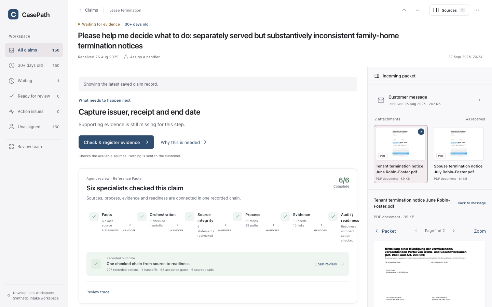

# CasePath

CasePath helps a claims handler answer a practical question: **why is this document needed for this claim now?** Its workbench keeps the original packet beside the process path, evidence state, and next action. It shows when a supporting source link has not been established.

The local workbench opens all 150 synthetic intake claims. It keeps source files, recorded observations, proposed work, and accepted handling events separate. Its default review is deterministic and makes no model API calls.



*A fictional claim after local review. The original notices remain visible beside the proposed next action; this product example is not a benchmark result.*

## See one claim

After starting the app, open [a family-home termination claim with two original notices](http://127.0.0.1:4173/#claim=clm_f69b1747447bc221). Read the message and both PDFs in **Sources**, then select **Start agent review**. The saved review shows what each role inspected and handed off. **Process** shows the current step and alternatives; **Evidence** shows what is present, missing, or unresolved. Select an item to inspect its reason and any accepted source link. Nothing is sent to a customer or settled by this review.

The [interactive method guide](docs/method-guide.md) gives a smaller teaching example: a repair may need an inspection report, or a service note and photo together. Changing the active condition or the available evidence changes the request. This authored example explains the controller; it is separate from measured benchmark cases.

## Run it locally

```sh
git clone https://github.com/KumarNavish/casepath.git
cd casepath
./bin/casepath prepare
./bin/casepath dev
```

Open <http://127.0.0.1:4173/>. The first `prepare` installs pinned Python 3.13.9 dependencies, so it needs internet access. Local use after preparation needs no provider account, API key, database service, or paid infrastructure. You also need Git, `uv`, `lsof`, and `lockf` on macOS or `flock` on Linux. Stop the server with Ctrl-C. Saved claim and review state stays in `.runtime/casepath-data-v1`; use a fresh clone for disposable tests. [Setup](docs/setup.md) covers replay, export, safe reset, and platform details.

```sh
./bin/casepath test
./bin/casepath replay <claim-id>
```

## What the release contains

| Start here | What you will find |
| --- | --- |
| [Claims workbench](casepath/README.md) | Claim queue, verified source previews, assessment, process and evidence views, Agent review, correction, export, and replay. |
| [150-claim data card](docs/INTAKE_PACKET_150.md) | Original intake inputs, attachment counts, schema, license, integrity checks, and limits. |
| [Method guide](docs/method-guide.md) | One executable teaching example of obligation-led evidence planning. |
| [Research evidence](docs/research-evidence.md) | Measured results, adverse findings, costs, and exact provenance. |
| [Paper and reproduction](research/casepath/iclr2027-integrated/README.md) | Manuscript, numerical audit, figures, benchmark outputs, and offline verification. |
| [Developer documentation](docs/README.md) | Setup, source authority, API contracts, recovery, and contribution rules. |

## What was measured

The paired branch study changes one case fact at a time. On 27 held-out pairs, CasePath made 15 unjustified signed document changes, versus 27 for Direct, 41 for Graph as context, and 52 for Evidence-first. It recovered 24 of 33 required changes; Direct recovered 25 and Graph as context 31. This is a selectivity result with a recall trade-off. The registered broad-superiority gate failed, and the historical arms used unequal computation.

The complete 150-claim study preserved its original native graph-interface failure. A separate retrospective current-case comparison found that inherited process scope reduced requests while retaining the same valid requests in the completed development subset. It does not turn the failed registered comparison into a success or establish counterfactual branch correctness. [Read the study definitions and exact results](docs/benchmark-and-baselines.md) before comparing numbers across studies.

Reproduce the released checks offline, without new inference:

```sh
python3 research/casepath/verify_release.py
```

The paper build also needs Tectonic, Matplotlib and SciencePlots. Put `tectonic` on `PATH`, or set `CASEPATH_TECTONIC` to its executable. The verifier reports any missing tool or failed check; it never calls a model.

The local workbench and Agent review demonstrate product mechanics, not legal correctness or general model quality. The current hosted Render services use an older source line; this repository's verified experience is the local one.

## Go deeper

- [How claim state is authorized](docs/architecture-authority.md)
- [Agent review and its verified external-worker boundary](docs/AGENT_REVIEW.md)
- [Contribution and source-sealing rules](CONTRIBUTING.md)
- [License](LICENSE) and [third-party notices](THIRD_PARTY_NOTICES.md)
