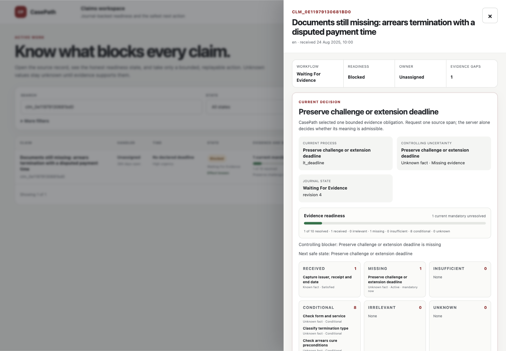
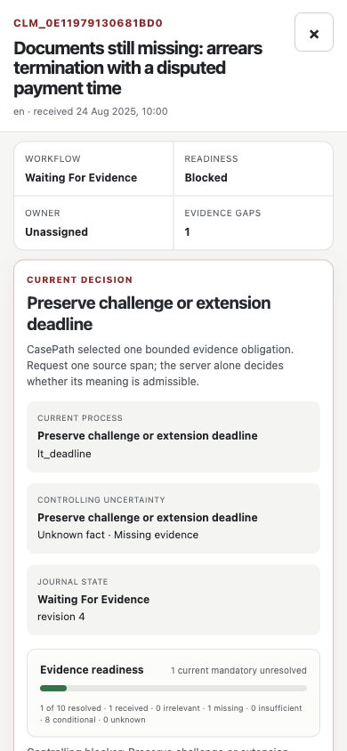

# Handoff validation

This record covers the source package exported to
`KumarNavish/casepath` on `main`. It does not describe a hosted release or
scientific evaluation. The default application uses deterministic local
execution and 60 public synthetic development claims. The runtime evidence
below was produced for source commit
`a283bd770e6348dca07b800dd9e0ec915ddc5ba5` before the content-preserving
standalone migration; the migration itself changed repository packaging and
documentation, not application behavior.

## Packaging

The repository includes source, pinned dependencies, tests, public corpus,
local launcher, release tools, API documentation, and a Pro implementation
handoff. Runtime databases, credentials, generated environments, private
research records, and the 90 reserved research inputs are excluded.

The complete original local corpus is outside this repository.
The source manifest binds the published source files and generated artifact
manifest. Runtime release identity is obtained from the actual Git checkout.

## Executed checks

On macOS, `./bin/casepath test` executed all 1,161 backend and release checks:
1,158 passed initially. Two failures came from test fixtures that had not been
updated for legacy state hashing and explicit archive commit identity. The
third correctly detected source changes made during the browser repair. The
fixtures were repaired and the source manifest regenerated. The focused rerun
of all three failing checks passed: **3 passed in 4.25 seconds**. The entire
1,161-check suite was not repeated after these focused repairs.

The public corpus rebuilt deterministically: all 259 file hashes matched the
shipped package, and its 60 IDs exactly matched the public development roster,
with zero reserved-claim overlap. Source and release verification passed before
the initial test run. JavaScript witness, evidence-panel, correction, carryover,
and receipt-hash tests passed.

## Browser evidence

The current working application was tested in an isolated localhost instance
with a temporary journal and no provider credentials. Checks covered search,
assignment persistence, original artifact retrieval against its manifest hash,
assessment, evidence-workbench creation, unsupported-evidence rejection,
interrupted replan recovery, and successful admission of one source observation.
The successful claim advanced from `lt_intake` to `lt_deadline`, showing one
received evidence item and the next missing obligation.

Browser testing found and repaired two client state-hash checks that did not
match the server's legacy serialization rules. The new regression also rejects
tampered state and native proposals. Keyboard focus wrapped correctly in both
directions at desktop and mobile widths. The 390-pixel mobile viewport had no
horizontal page overflow. These are focused checks, not a complete accessibility
or device certification.

See [the machine-readable checks](HANDOFF_BROWSER_CHECKS.json).





## Standalone migration checks

The standalone migration removed the personal portfolio/Jekyll/Vite surfaces,
all inherited GitHub deployment and scheduler workflows, obsolete v6/v12
transport chunks, the active ChatGPT Sites project binding, and the active root
Render Blueprint. The old Blueprint remains only as the warned historical test
fixture `casepath/tools/fixtures/render-legacy-20260811.yaml`.

The source seal regenerated 25 artifacts, scanned 24 model-visible artifacts
with no leakage finding, built the 30-file ignored static output, and verified
the content-only `casepath.source-manifest/2.1.0` roster. A repository check
confirmed 60 claim JSON files, 259 total files in `synthetic-dev-60`, zero active
root deployment configurations, and resolved relative links across the focused
Markdown documentation.

The focused release and launcher regressions ran with the pinned Python 3.13.9
environment:

```bash
python -m pytest -q \
  casepath/tools/test_casepath_release.py::test_release_contract_and_manifests_are_current \
  casepath/tools/test_casepath_release.py::test_source_manifest_requires_exact_known_commit_static_identity \
  casepath/tools/test_casepath_release.py::test_root_knowledge_transfer_is_inventoried_as_release_source \
  casepath/tools/test_casepath_release.py::test_source_manifest_keeps_runtime_commit_outside_self_excluded_bytes \
  casepath/tools/test_casepath_release.py::test_prepare_artifacts_keeps_sealed_source_manifest_immutable \
  casepath/tools/test_casepath_release.py::test_render_uses_curated_frontend_and_model_aware_readiness_probe \
  casepath/tools/test_casepath_release.py::test_render_definitive_qa_contract_rejects_tampering \
  casepath/tools/test_casepath_release.py::test_render_curated_frontend_contract_rejects_tampering \
  casepath-api/tests/test_cli_v1.py::test_launcher_accepts_only_a_closed_manifest_roster_without_git \
  casepath-api/tests/test_cli_v1.py::test_launcher_resolves_runtime_commit_from_git_authority \
  casepath-api/tests/test_cli_v1.py::test_prepare_rebuilds_ignored_outputs_after_source_only_preflight
```

Result: **15 passed in 4.57 seconds**. `./bin/casepath prepare` then verified the
sealed roster before materializing its immutable source capsule. `git diff
--check` passed before commit.

Port 4173 was already occupied by another application and was preserved. The
standalone migration therefore did not run `dev`, seed a journal, repeat the
1,161-test suite, run browser QA, call a provider, perform paid review, or
deploy. The prior focused browser evidence remains the applicable runtime
evidence because the migration did not change browser or API behavior. An
external Markup AI prose review was unavailable; the focused documentation was
checked locally for link resolution, current repository/branch guidance, and
historical-surface warnings.

## Scope

Historical QA programs that name the 150-claim protocol are retained as source,
with their original contracts. The 90 reserved inputs are absent. The programs
have not been recast as 60-claim research results.
Linux, native Windows, hosted deployment, paid inference, and a full product
redesign are not established by a macOS repository packaging check.
