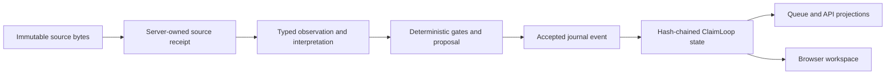

# Architecture and authority

CasePath serves a static browser workspace and a FastAPI application from one
loopback origin. The launcher verifies the committed source roster, builds an
immutable source capsule, prepares generated artifacts, and starts the API with
a durable SQLite journal and local artifact registry.

## Lifecycle authority

`claim_loop_events` is the sole lifecycle authority. Checkpoints, queue rows,
browser state, correction indexes, artifact indexes, and exports are derived or
admission surfaces. None can override a validated journal. The normal workspace
stores versioned events in the same table under a reserved local session and a
`workspace.<claim-id>` loop namespace.

Mutation requests use exact idempotency keys and expected revisions. Exact
retries return the existing result. Reusing a key for different input or
submitting a stale revision fails closed. Restart reconstructs state from the
validated hash chain; replay reads it without repair.

## Source and evidence authority

Each of the 150 operational intake cases has an immutable claim binding for the
observable message, attachments, source registry, and static policy template. File
hashes and self-hashes are verified before the API starts. The legacy 60-case
corpus remains unchanged for regression tests. An artifact identifier supplied by
a caller is a lookup request, not proof of content or claim scope.

An observation records what a source reports. An interpretation records its
bounded meaning. A proposal recommends an action. Only a validated accepted
event changes lifecycle state. Evidence sufficiency, deadlines, causation,
decision, and readiness stay unknown when admitted sources do not support them.

## Deterministic local execution

The local launcher unsets provider and tracing credentials and selects the
deterministic reference runner. The logical specialist roles and deterministic
gates still execute, but no model or provider call occurs. This validates
orchestration and authority mechanics, not the quality of model reasoning.

The same application also mounts a persisted six-role Agent review layer. Its
work database records source reads, proposals, handoffs, gates, and completion
coverage but does not become claim lifecycle authority. `./bin/casepath dev` uses
the provider-free reference Facts worker. A separately configured external Facts
worker has been accepted through the same tools and gates; configuration or model
failure cannot silently promote a claim or substitute another worker. See
[Agent review workflow](AGENT_REVIEW.md).

## Runtime boundaries

| Boundary | Authority |
| --- | --- |
| Authored source | `casepath/source-manifest.json` plus Git checkout |
| Generated source artifacts | `casepath-api/artifacts/artifact-manifest.json` |
| Runtime source identity | immutable capsule and boot receipt |
| Claim lifecycle | hash-chained `claim_loop_events` |
| Agent review work | `agent-work-v1.sqlite3`; inspectable work, never lifecycle authority |
| Local uploaded bytes | server-owned artifact registry receipts |
| Browser and queue | read-only projections of validated state |

The local product is single-user and loopback-only. Authentication,
multi-tenancy, external adapter execution, hosted operation, and real-claim
approval are outside this handoff.
